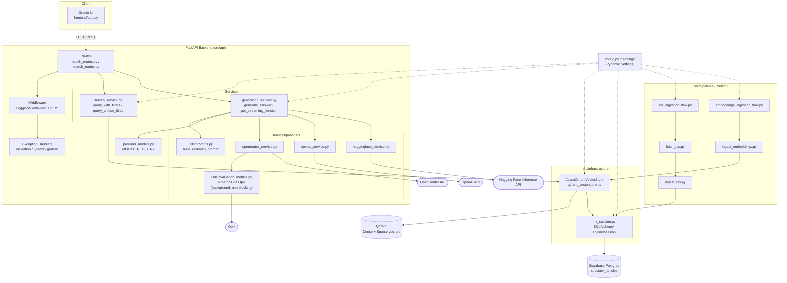
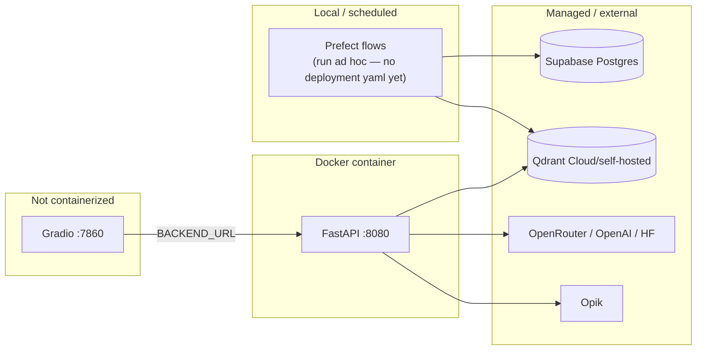

# Architecture

> Technical architecture reference for the Substack Newsletters Search System.
> Reflects the verified state of the codebase as of 2026-07-27. See [CLAUDE.md](CLAUDE.md) for
> AI-agent-oriented notes and known gaps/gotchas.

## Table of Contents

1. [High-Level Architecture](#1-high-level-architecture)
2. [Component Diagram](#2-component-diagram)
3. [Request Flow](#3-request-flow)
4. [Sequence Diagram](#4-sequence-diagram)
5. [Folder Explanation](#5-folder-explanation)
6. [Data Models](#6-data-models)
7. [External Services](#7-external-services)
8. [Deployment](#8-deployment)

---

## 1. High-Level Architecture

The system is a Retrieval-Augmented Generation (RAG) application split into two independent
runtimes that share a common `src/` core, plus an offline ingestion pipeline:

- **Ingestion pipeline** (Prefect flows/tasks, run on demand or scheduled): pulls Substack RSS
  feeds into Postgres, then chunks + embeds articles into Qdrant.
- **Serving layer** (FastAPI): stateless HTTP API that performs hybrid vector search and
  orchestrates LLM generation across three interchangeable providers.
- **Presentation layer** (Gradio): a thin UI client that only talks to the FastAPI backend over
  HTTP — it holds no business logic of its own.

```
                    ┌───────────────────────────────────────────────┐
                    │              INGESTION (offline)               │
                    │                                                │
   feeds_rss.yaml ─▶│  rss_ingest_flow  ──▶  Supabase (Postgres)     │
                    │        │ Prefect            │                  │
                    │        ▼                    ▼                  │
                    │  qdrant_ingest_flow ──▶  Qdrant (vector store) │
                    └───────────────────────────────────────────────┘
                                          ▲
                                          │ reads articles / writes vectors
                                          │
   ┌──────────────┐   HTTP    ┌──────────┴───────────┐   HTTP    ┌─────────────────────┐
   │  Gradio UI   │◀─────────▶│   FastAPI backend     │◀─────────▶│  LLM Providers      │
   │ (frontend/   │  REST     │   (src/api)           │  REST     │  OpenRouter / OpenAI│
   │  app.py)     │           │  search + generation  │           │  / Hugging Face     │
   └──────────────┘           └───────────────────────┘           └─────────────────────┘
                                          │
                                          ▼
                                    Opik (tracing +
                                    6-metric evaluation)
```

Key architectural properties:

- **Stateless API, stateful clients**: FastAPI holds no per-user state; the only shared mutable
  object is `app.state.vectorstore` (a single `AsyncQdrantVectorStore`), created once at startup.
- **Provider-agnostic generation**: routes and services never reference a specific LLM SDK — they
  go through a registry (`MODEL_REGISTRY`) and a uniform `generate_*`/`stream_*` function contract.
- **Hybrid retrieval**: every search combines dense (semantic) and sparse (BM25 keyword) vectors
  via Qdrant's native Reciprocal Rank Fusion (RRF), not an application-level re-ranker.
- **Idempotent ingestion**: point IDs in Qdrant are deterministic hashes of `url + chunk text`, so
  re-running ingestion never creates duplicate vectors.

---

## 2. Component Diagram



---

## 3. Request Flow

Two distinct user-facing flows exist, both entered from the Gradio UI:

### 3.1 Article Search (`/search/unique-titles`) — no LLM

```
User enters keywords + optional filters (author/newsletter/article author(s)/title keywords)
  → Gradio POST /search/unique-titles
  → search_routes.search_unique()
  → search_service.query_unique_titles():
      1. Embed query (dense + sparse)
      2. Build Qdrant Filter from feed_author / feed_name / article_author (MatchAny) /
         title_keywords
      3. Overfetch: query_points(FusionQuery(RRF), prefetch=[Dense, Sparse], limit=limit*280)
         — limit itself is capped at MAX_RESULT_LIMIT=25 by the request schema
      4. Deduplicate by article title, keep first (highest-fused-rank) hit per title, cap at `limit`
  → UniqueTitleResponse{results: [SearchResult...]}
  → Gradio renders results as an HTML card list
```

### 3.2 Ask AI (`/search/ask` or `/search/ask/stream`) — LLM-backed

```
User enters a natural-language question + optional filters + provider/model choice
  → Gradio POST /search/ask[/stream]
  → search_routes.ask_with_generation[_stream]()
  → Step 1: search_service.query_with_filters()
      Same hybrid RRF search as above, but deduplicates by point ID (not title) — so
      multiple chunks from the same article can appear, giving the LLM richer context.
      Overfetch multiplier here is limit*100.
  → Step 2: generation_service.generate_answer() / get_streaming_function()
      a. build_research_prompt(contexts, query) — injects all retrieved chunks with
         source attribution (title/author/URL), enforces Markdown + citation rules
      b. MODEL_REGISTRY.get_config(provider) — resolves ModelConfig (primary model,
         candidate models, temperature, max_completion_tokens)
      c. Dispatch to provider module:
           - openrouter: generate_openrouter / stream_openrouter (model auto-routing
             via OpenRouter's `provider.sort` + candidate `models` list)
           - openai: generate_openai / stream_openai
           - huggingface: generate_huggingface / stream_huggingface
      d. (OpenRouter only) schedule_evaluation(query, answer, context_chunks) — fire-and-forget
         (asyncio.create_task, never awaited), so it adds zero latency to the response. If
         OPIK__ENABLE_EVALUATION is true and an OpenAI key is configured, scores 6 metrics
         concurrently — faithfulness / coherence / completeness (custom G-Eval) plus
         hallucination / answer_relevance / usefulness (Opik built-in metrics) — using GPT-4o
         as judge, then attaches them to the request's Opik trace as feedback scores
         (only works for this non-streaming path — see §3.3)
  → Non-streaming: AskResponse{answer, sources, model, finish_reason}
  → Streaming: chunked text response with inline __model_used__ / __error__ /
    __truncated__ markers, parsed live by the Gradio frontend and rendered as
    Markdown → HTML
```

### 3.3 Evaluation pipeline (background, non-blocking)

```
generate_answer() [non-streaming /ask only]
  → captures the active Opik trace ID via opik_context.get_current_trace_data()
    (only available because this call happens synchronously inside generate_answer's
    own @opik.track span)
  → asyncio.create_task(...) — the response returns immediately; evaluation runs after
  → evaluate_metrics(query, answer, context_chunks):
      1. Skip (return None) if disabled, no OpenAI key, or empty output
      2. judge_model = LiteLLMChatModel("gpt-4o")
      3. Run 6 scoring coroutines concurrently via asyncio.gather:
           - 3x GEval (custom task/criteria prompts): faithfulness, coherence, completeness
           - Hallucination, AnswerRelevance, Usefulness (Opik's pre-built metric classes)
      4. Each returns {"score", "reason", "failed"} — a single metric failing doesn't affect
         the other five (each wrapped in its own try/except)
  → opik.Opik().log_traces_feedback_scores(scores=[{"id": trace_id, "name": "eval_<metric>", ...}])
    — this is what actually makes scores appear on the Opik dashboard; without this call,
    GEval/metric.ascore() only ever computes a score locally
```

**Known limitation:** `get_streaming_function`'s `@opik.track` decorator only wraps the
near-instant synchronous construction of the `stream_gen` closure — by the time the actual
streaming (and therefore `schedule_evaluation`) runs, that span has already closed. So for
`/ask/stream`, evaluation still runs and results are still logged, but `trace_id` is `None` and
there's no trace to attach scores to — they never reach the Opik dashboard for that path. Only
non-streaming `/ask` gets full dashboard integration today.

**Workspace configuration is critical.** Opik's SDK defaults `workspace` to `"default"` if
`OPIK__WORKSPACE` is unset. If your real Comet/Opik workspace has a different name, both traces
and evaluation scores are silently sent to the wrong workspace — this was the root cause of an
earlier "nothing shows up on the dashboard" investigation in this project's history. A visible
symptom is `OPIK: Unauthorized` / 401 messages in the app's console.

---

## 4. Sequence Diagram

The streaming Ask-AI path, which exercises the most components:

```mermaid
sequenceDiagram
    actor User
    participant Gradio as Gradio UI
    participant Route as search_routes.py
    participant Search as search_service.py
    participant VS as AsyncQdrantVectorStore
    participant Qdrant
    participant Gen as generation_service.py
    participant Prompt as prompts.py
    participant Provider as openrouter_service.py
    participant LLM as OpenRouter API
    participant Eval as evaluation_metrics.py
    participant Opik

    User->>Gradio: Enter question + filters, click "Ask AI"
    Gradio->>Route: POST /search/ask/stream
    Route->>Search: query_with_filters(query, filters)
    Search->>VS: dense_vectors([query]), sparse_vectors([query])
    VS-->>Search: dense_vec, sparse_vec
    Search->>Qdrant: query_points(FusionQuery(RRF), prefetch=[Dense, Sparse])
    Qdrant-->>Search: fused, ranked points
    Search-->>Route: list[SearchResult] (deduped by point ID)

    Route->>Gen: get_streaming_function(provider, query, contexts)
    Gen->>Prompt: build_research_prompt(contexts, query)
    Prompt-->>Gen: prompt string
    Gen->>Gen: MODEL_REGISTRY.get_config(provider)
    Gen-->>Route: stream_gen() closure

    Route->>Provider: stream_openrouter(prompt, config)
    activate Provider
    Provider->>LLM: chat.completions.create(stream=True)
    loop token chunks
        LLM-->>Provider: delta chunk
        Provider-->>Route: yield chunk
        Route-->>Gradio: yield chunk (chunked HTTP response)
        Gradio-->>User: append to Markdown output (live)
    end
    LLM-->>Provider: finish_reason
    deactivate Provider

    Note over Gen,Eval: schedule_evaluation() is fire-and-forget (asyncio.create_task) —<br/>the stream has already completed by this point; nothing below blocks the user
    Gen->>Eval: schedule_evaluation(query, full_output, context_chunks)
    activate Eval
    Eval->>Eval: opik_context.get_current_trace_data() → None<br/>(get_streaming_function's span already closed)
    Eval->>Opik: 6x metric.ascore() concurrently — 3 custom GEval +<br/>Hallucination/AnswerRelevance/Usefulness (judge=gpt-4o)
    Opik-->>Eval: scores
    Note over Eval: No trace_id available for this path, so scores are<br/>logged locally only — never attached to a trace on the<br/>dashboard. (Non-streaming /ask does attach successfully;<br/>see §3.3.)
    deactivate Eval
```

---

## 5. Folder Explanation

```
src/
├── config.py                      Pydantic Settings — single source of truth for all env config.
│                                   Nested classes (Supabase/Qdrant/RSS/TextSplitter/Jina/
│                                   HuggingFace/OpenAI/OpenRouter/Opik) map via `__` delimiter.
├── configs/
│   └── feeds_rss.yaml             Declarative list of RSS feeds to ingest (name, author, url).
├── models/                        Shared data contracts used across layers.
│   ├── sql_models.py               SQLAlchemy ORM: SubstackArticle table definition.
│   ├── article_models.py           Pydantic: FeedItem, ArticleItem (pipeline-internal).
│   └── vectorstore_models.py        Pydantic: ArticleChunkPayload (Qdrant point payload shape).
├── api/                            FastAPI application.
│   ├── main.py                     App factory, lifespan (inits/closes AsyncQdrantVectorStore),
│   │                               CORS, middleware and exception handler registration.
│   ├── routes/                     Thin HTTP adapters — no business logic.
│   │   ├── health_routes.py         GET / , /health , /ready (Qdrant connectivity check).
│   │   └── search_routes.py         POST /unique-titles, /ask, /ask/stream.
│   ├── services/                   Business logic layer.
│   │   ├── search_service.py         Hybrid vector search + dedup strategies.
│   │   ├── generation_service.py     Prompt building, provider dispatch, streaming orchestration.
│   │   └── providers/                One module per LLM provider, uniform generate/stream contract.
│   │       ├── openrouter_service.py
│   │       ├── openai_service.py
│   │       ├── huggingface_service.py
│   │       └── utils/
│   │           ├── prompts.py         build_research_prompt() — the RAG prompt template.
│   │           ├── evaluation_metrics.py  6-metric LLM-judge scoring (3 custom G-Eval + 3 Opik
│   │           │                     built-ins) via schedule_evaluation() — fire-and-forget,
│   │           │                     config-gated (OPIK__ENABLE_EVALUATION), sends feedback
│   │           │                     scores to the originating Opik trace (OpenRouter path only).
│   │           └── messages.py        Chat-message list construction for OpenAI-style APIs.
│   ├── models/                     API-facing Pydantic schemas.
│   │   ├── api_models.py            SearchResult, Ask*/UniqueTitle* request/response models.
│   │   └── provider_models.py       ModelConfig, MODEL_REGISTRY (provider → model config map).
│   ├── exceptions/                 exception_handlers.py — validation/Qdrant/generic → JSON.
│   └── middleware/                 logging_middleware.py — per-request timing/status logging.
├── infrastructure/                 Adapters to external systems.
│   ├── supabase/
│   │   ├── init_session.py          Engine/session factory (connection pooling, URL-encodes pw).
│   │   ├── create_db.py / delete_db.py   Table lifecycle scripts (no migration tool).
│   │   └── (init_session imports from src.config)
│   └── qdrant/
│       ├── qdrant_vectorstore.py    AsyncQdrantVectorStore — the central class: collection
│       │                           management, dense/sparse embedding, ingestion pipeline.
│       ├── create_collection.py     One-shot: create collection (HNSW disabled for bulk load).
│       ├── create_indexes.py        One-shot: enable HNSW + create payload indexes.
│       ├── delete_collection.py     One-shot: interactive delete (prompts for confirmation).
│       └── ingest_from_sql.py       One-shot: direct SQL→Qdrant ingestion, bypassing Prefect.
├── pipelines/                      Prefect orchestration.
│   ├── flows/
│   │   ├── rss_ingestion_flow.py    Fan-out fetch per feed, then ingest; error aggregation.
│   │   └── embeddings_ingestion_flow.py  Resolves from_date, invokes the embedding task.
│   └── tasks/
│       ├── fetch_rss.py             HTTP + XML parse + paywall detection + Markdown conversion.
│       ├── ingest_rss.py            Batched bulk insert into Postgres.
│       └── ingest_embeddings.py     Thin wrapper invoking AsyncQdrantVectorStore.ingest_from_sql.
└── utils/
    ├── text_splitter.py             LangChain RecursiveCharacterTextSplitter wrapper.
    └── logger_util.py               Context-aware logger: Prefect run logger inside flows,
                                     Loguru elsewhere; log_batch_status() for throughput/memory logs.

frontend/
└── app.py                          Gradio Blocks UI. Talks only to FastAPI over HTTP
                                     (BACKEND_URL). Owns no business logic — just request
                                     building, response parsing, and HTML rendering.

tests/
├── conftest.py                     db_engine/db_session fixtures (session-scoped autouse
│                                   ensure_test_tables fixture auto-creates substack_test),
│                                   Prefect cache cleanup.
├── unit/                           test_fastapi.py (fully mocked: fake AsyncQdrantVectorStore
│                                   + patched generate_openrouter, no live service dependency),
│                                   test_evaluation_metrics.py (9 tests, mocks all metric
│                                   classes and the Opik client), test_fetch_rss_entries.py.
├── integration/                    test_db_connection.py, test_rss_pipeline.py (needs live DB).
└── test_models/                    test_sql_models.py.

static/                             Images used in README (diagrams, screenshots) — not app code.
main.py, test_prefect.py            Scratch/scaffold files at repo root — not the real entry
                                     point or test suite (see CLAUDE.md for details).
```

---

## 6. Data Models

### 6.1 Relational (Supabase Postgres)

`SubstackArticle` (`src/models/sql_models.py`) — table name from `settings.supabase_db.table_name`
(default `substack_articles`):

| Column | Type | Notes |
|---|---|---|
| `id` | BigInteger | Primary key |
| `uuid` | UUID | Unique, auto-generated (`uuid.uuid4`) |
| `feed_name` | String | Not null |
| `feed_author` | String | Not null |
| `article_authors` | `ARRAY(String)` | Not null |
| `title` | String | Not null |
| `url` | String | Unique, not null |
| `content` | Text | Markdown-converted article body |
| `published_at` | Timestamp | Not null |
| `created_at` | Timestamp | Server default `now()` |

### 6.2 Pipeline-internal (Pydantic)

- **`FeedItem`** (`article_models.py`): `name`, `author`, `url` — one entry per configured feed.
- **`ArticleItem`** (`article_models.py`): `feed_name`, `feed_author`, `title`, `url`, `content`,
  `article_authors: list[str]`, `published_at: str | None` — the parsed-but-not-yet-persisted
  representation produced by `fetch_rss_entries`.
- **`ArticleChunkPayload`** (`vectorstore_models.py`): `feed_name`, `feed_author`,
  `article_authors: list[str]`, `title`, `url`, `published_at`, `created_at`, `chunk_index`,
  `chunk_text` — the exact shape stored as a Qdrant point payload (`.dict()`'d at upsert time).

### 6.3 Vector store (Qdrant point)

Each point = one article chunk:

- **Vectors**: `Dense` (768-float array, cosine distance), `Sparse` (indices/values, IDF-modified)
- **Payload**: the `ArticleChunkPayload` fields above (flat dict)
- **ID**: deterministic — `uuid.UUID(sha256(f"{article.url}_{chunk}").hexdigest()[:32])`

### 6.4 API layer (Pydantic, `src/api/models/api_models.py`)

| Model | Fields | Used by |
|---|---|---|
| `SearchResult` | `title`, `feed_author`, `feed_name`, `article_author: list[str] \| None`, `url`, `chunk_text`, `score` | Both search endpoints |
| `UniqueTitleRequest` | `query_text` (max_length=2000), `feed_author`, `feed_name`, `article_author`, `title_keywords`, `limit` (1–25, `MAX_RESULT_LIMIT`) | `/unique-titles` |
| `UniqueTitleResponse` | `results: list[SearchResult]` | `/unique-titles` |
| `AskRequest` | `query_text` (max_length=2000), `feed_author`, `feed_name`, `article_author`, `title_keywords`, `limit` (1–25), `provider: LLMProvider` (enum, case-insensitive via `field_validator`), `model` | `/ask`, `/ask/stream` |
| `AskResponse` | `query`, `provider`, `answer`, `sources: list[SearchResult]`, `model`, `finish_reason` | `/ask` |
| `AskStreamingChunk` / `AskStreamingResponse` | `delta` / `chunks: list[AskStreamingChunk]` | Documentation of the stream shape (actual wire format is plain chunked text, not this JSON schema) |

`article_author` is a real, working filter (`MatchAny` against the Qdrant `article_authors`
payload field, wired through both routes and both search functions) — it used to be accepted by
the schema but silently ignored; that's fixed.

### 6.5 Provider configuration (`src/api/models/provider_models.py`)

```python
class LLMProvider(str, Enum):
    openrouter = "openrouter"
    openai = "openai"
    huggingface = "huggingface"

ModelConfig:
  primary_model: str
  candidate_models: list[str]         # fallback/routing candidates (OpenRouter)
  provider_sort: ProviderSort          # e.g. "latency"
  stream: bool
  max_completion_tokens: int = 5000
  temperature: float = 0.0

MODEL_REGISTRY: dict[str, ModelConfig]  # keyed by provider name — "openrouter", "openai",
                                         # "huggingface" all registered
```

`AskRequest.provider` is typed as `LLMProvider` with a `field_validator(mode="before")` that
lowercases string input, so `"OpenRouter"`, `"OPENAI"`, etc. all validate correctly, and an
unrecognized provider now fails as a clean 422 at the API boundary instead of a 500 raised deep in
`generate_answer`.

---

## 7. External Services

| Service | Role | Integration point | Required for |
|---|---|---|---|
| **Supabase (Postgres)** | Canonical article storage | `src/infrastructure/supabase/*`, SQLAlchemy | Ingestion + as the source for embedding |
| **Qdrant** | Hybrid vector store (dense + sparse) | `src/infrastructure/qdrant/qdrant_vectorstore.py` | All search/ask functionality |
| **Fastembed** (local, in-process) | Dense embedding model (`BAAI/bge-base-en`, 768-dim) and BM25 sparse model | Loaded inside `AsyncQdrantVectorStore.__init__` | Embedding at ingest time and query time |
| **OpenRouter** | Primary/default LLM provider, free-tier model routing | `openrouter_service.py` (OpenAI-compatible client, `base_url=openrouter.ai/api/v1`) | `/ask*` with `provider="openrouter"` |
| **OpenAI** | Secondary LLM provider + LLM-judge model (`gpt-4o`) for evaluation | `openai_service.py`, `evaluation_metrics.py` | `/ask*` with `provider="openai"`; judge model for all 6 evaluation metrics |
| **Hugging Face** | Tertiary LLM provider (Inference API) | `huggingface_service.py` (`AsyncInferenceClient`) | `/ask*` with `provider="huggingface"` |
| **Jina AI** (optional, disabled by default) | Alternative dense embedding API | `AsyncQdrantVectorStore.jina_dense_vectors`, gated by `self.use_jina = False` | Not active unless manually enabled in code |
| **Opik** | LLM call tracing (`@opik.track` + `track_openai`) + 6-metric LLM-judge evaluation, with real feedback-score logging to the dashboard | `openrouter_service.py`, `openai_service.py`, `evaluation_metrics.py` | Observability always-on; evaluation additionally needs `OPIK__ENABLE_EVALUATION=true` + an OpenAI key + a correctly-set `OPIK__WORKSPACE` |
| **Prefect** (server/cloud, not yet configured for deployment) | Orchestration of ingestion flows, retry/scheduling, run-history lookups (`get_last_successful_run`) | `src/pipelines/flows/*` | Ingestion pipeline scheduling and incremental `from_date` resolution |

All provider credentials/URLs are supplied via `.env` and consumed exclusively through
`src/config.py::settings` — no service is called with hardcoded credentials.

---

## 8. Deployment

### 8.1 Local development

```bash
cp .env.example .env        # fill in Supabase/Qdrant/LLM provider credentials
uv sync --all-groups
make supabase-create
make qdrant-create-collection
make ingest-rss-articles-flow
make ingest-embeddings-flow
make qdrant-create-index    # enable HNSW + payload indexes after bulk load
make run-api                # terminal 1 — FastAPI on :8080
make run-gradio              # terminal 2 — Gradio on :7860
```

### 8.2 Containerized (FastAPI only)

`Dockerfile` is a two-stage `uv`-based build:

1. **Builder stage** (`ghcr.io/astral-sh/uv:python3.12-bookworm-slim`): copies `pyproject.toml` +
   `uv.lock`, runs `uv sync --locked --no-install-project --no-dev` (dependency layer caching),
   then copies source and runs `uv sync --locked --no-dev` to install the project itself.
2. **Runtime stage** (`python:3.12-slim-bookworm`): copies the built `/app` (including `.venv`)
   from the builder, sets `PATH`/`PYTHONPATH`, points `HF_HOME` and `FASTEMBED_CACHE` at `/tmp`
   (required because Cloud Run's default HF cache directory is read-only), exposes port 8080, adds
   a container `HEALTHCHECK` against `/health`, and runs
   `uvicorn src.api.main:app --host 0.0.0.0 --port 8080`.

```bash
docker build -t substack-rag .
docker run --env-file .env -p 8080:8080 substack-rag
```

The Gradio frontend is **not** containerized in this repo — it's expected to run locally or be
deployed separately, pointed at the FastAPI backend via `BACKEND_URL`.

### 8.3 Cloud / CI-CD (aspirational — not present in this checkout)

The project's own docs describe a Google Cloud Run deployment (`deploy_fastapi.sh` +
`cloudbuild_fastapi.yaml`), GitHub Actions CI/CD (`.github/workflows/ci.yml` / `cd.yml`), and
Prefect Cloud/local deployment manifests (`prefect-cloud.yaml` / `prefect-local.yaml`). **None of
these files currently exist in this repository** — `.github/workflows/` is empty and the
Makefile targets `deploy-cloud-flows` / `deploy-local-flows` reference YAML files that are not
checked in. Treat this as the next milestone rather than current infrastructure; see CLAUDE.md
"Known Gaps" for the full list.

### 8.4 Runtime topology at a glance


